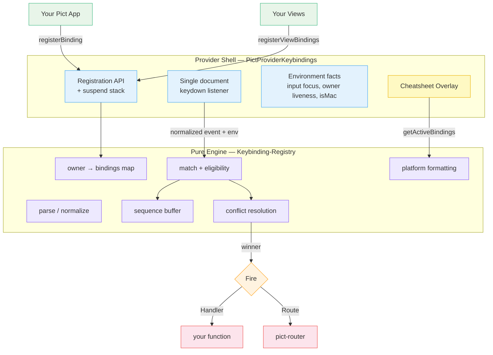
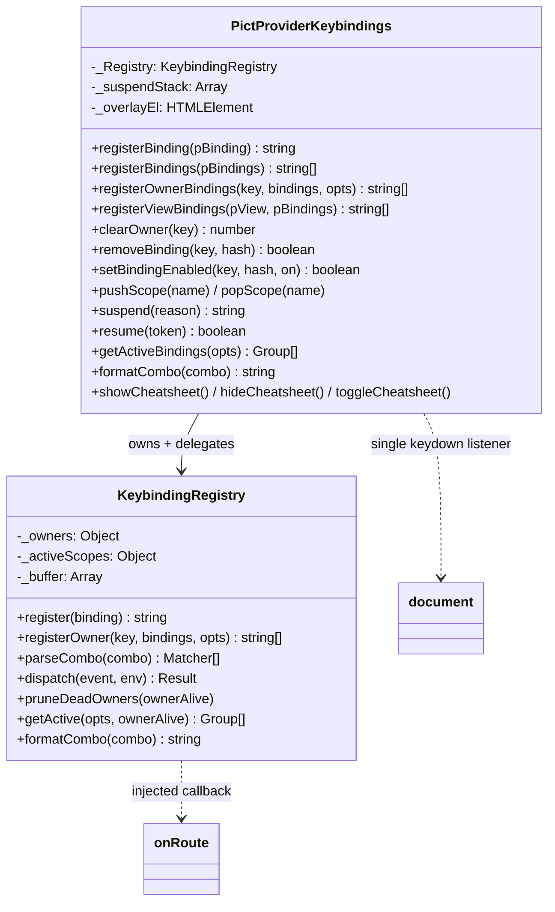
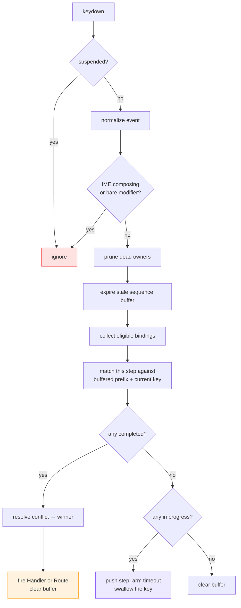
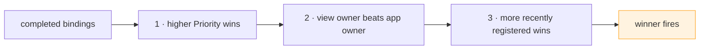
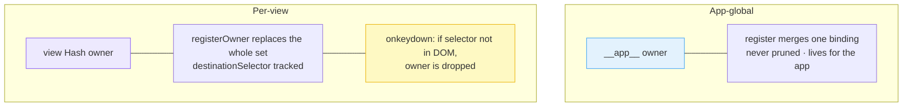
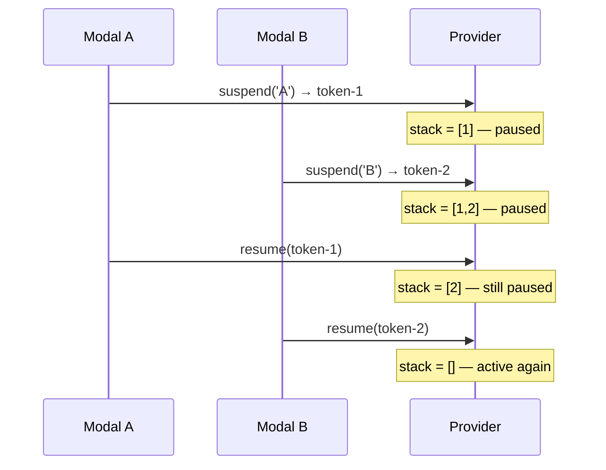

# Architecture

Pict-Provider-Keybindings is built as two cooperating pieces: a **pure, DOM-free matching engine** and a **thin browser shell** that wraps it. This split is the central design decision — it keeps essentially all of the interesting behavior unit-testable with plain event objects, with no jsdom.

## High-Level Design

The shell (`source/Pict-Provider-Keybindings.js`) owns everything that needs the browser: the single keydown listener, the input/owner-liveness checks, `isMac` detection, the suspend stack, and the overlay DOM. The engine (`source/Keybinding-Registry.js`) owns everything that does not: parsing, normalization, matching, sequence buffering, conflict resolution, grouping, and platform-aware formatting. Environmental facts flow **in** as plain data; firing a `Route` flows **out** through an injected callback.

## Module Relationships

The provider's registration methods are mostly thin pass-throughs to the engine. The provider adds the browser-aware bits the engine deliberately refuses to know about.

## The Dispatch Pipeline

Every `keydown` flows through one function — `Keybinding-Registry.dispatch(event, env)` — after the shell normalizes the DOM event and computes the two environment facts (`inputFocused`, `ownerAlive`).

Key guards, in order:

1. **Suspended** — if any `suspend()` token is outstanding (or `DisableAllShortcuts` is set), nothing matches.
2. **IME / bare modifier** — `isComposing` or `keyCode === 229` (CJK / dead keys) never match; a lone `Shift`/`Control`/`Alt`/`Meta` press is never a binding by itself.
3. **Dead-owner pruning** — owners whose declared destination selector is no longer in the DOM are dropped before matching, so an unmounted view's bindings can never fire.
4. **Sequence expiry** — an in-progress sequence older than `SequenceTimeoutMS` is discarded.

## Eligibility

A binding is **eligible** for the current event only if it passes every filter in `_eligibleBindings`:

| Filter | Rule |
|--------|------|
| Enabled | `Enabled !== false` |
| Scope | no `Scope`, or the binding's scope is currently active |
| Auto-repeat | not an `event.repeat`, unless `AllowRepeat` is set |
| Input focus | not while an input is focused, unless `AllowInInput` is set **or** the first step carries a real modifier (`Mod`/`Ctrl`/`Meta`/`Alt`) |

The input-focus rule is the subtle one: bare keys (`n`, `?`) and Shift-only chords are suppressed while the user types, but real modifier chords (`Mod+S`) still fire — matching the convention users expect from native apps.

## Conflict Resolution

When more than one binding completes on the same event, `_resolveConflict` picks a single winner with a deterministic three-key sort:

1. **Priority** — higher `Priority` (default `500`) wins.
2. **Owner** — at equal priority, a **view-owned** binding beats an **app-global** one, so a focused view can locally override a global shortcut.
3. **Recency** — at an equal priority and owner class, the most recently registered binding wins.

## Owner Lifecycle

Every binding belongs to an owner, and owners come in two flavors:

- `registerBinding()` **merges** a single binding under the reserved `__app__` owner.
- `registerOwnerBindings()` / `registerViewBindings()` **replace** an owner's entire set. That is what makes per-view registration idempotent across re-renders — calling it again in `onAfterRender` simply overwrites the previous set rather than duplicating it.
- `registerViewBindings(view, ...)` derives the owner key from the view's `Hash` and the destination selector from the view's `DefaultDestinationAddress` (or its first renderable's `ContentDestinationAddress`). Because that selector is tracked, the engine prunes the owner the moment the view's DOM is gone — which is why no destroy hook is needed.

## Suspend / Resume

`suspend()` is **ref-counted**, not a boolean. It returns a unique token and pushes onto a stack; `resume(token)` removes that one entry. Shortcuts are paused while the stack is non-empty, so two independent owners (say, a modal and a drag operation) can each suspend and resume without stepping on each other.

## Sequences

A combo string is split on whitespace into **steps**; each step is split on `+` into modifier tokens plus one key. A single-step combo (`Mod+S`) is a chord; a multi-step combo (`g i`, `Mod+K Mod+S`) is a sequence. The engine keeps a small buffer of completed steps with an expiry timestamp:

- A partial match pushes the step, arms the `SequenceTimeoutMS` timeout, and **swallows** the key so it does not leak to the page.
- A completing match fires the winner and clears the buffer.
- A non-matching key, or a key after the timeout, resets the buffer.

This is how `g i` and `g g` coexist unambiguously, and how the first `g` of a sequence does not also type a literal "g" into the page.

## Platform-Aware Formatting

`formatCombo()` and the cheatsheet render `Matchers` back to display tokens per platform. On macOS the modifiers become glyphs (`⌃ ⌥ ⇧ ⌘`) joined with no separator (`⌘K`); elsewhere they become words joined with `+` (`Ctrl+K`). Named keys get friendly glyphs too (`ArrowUp` → `↑`, `Enter` → `↵`, `Escape` → `Esc`). `Mod` resolves to `⌘`/`Ctrl` at format time exactly as it does at match time, so the cheatsheet always shows what the user's own keyboard will actually do.

## The Cheatsheet Overlay

`showCheatsheet()` builds its HTML from `getActiveBindings()` — the grouped, display-ready, dead-owner-pruned set of currently-active shortcuts — and injects it into a provider-owned overlay element appended to `document.body`. Group order follows the `GroupOrder` config; within a group, bindings sort by name. Styling is entirely CSS custom properties with hand-picked fallbacks, registered through Pict's `CSSMap` at priority 500, so it follows the host theme but still looks right with no theme provider. Set `UseModalForCheatsheet: true` to render through [pict-section-modal](https://fable-retold.github.io/pict-section-modal/) instead.

## Design Patterns

### Pure Core, Injected Environment

The engine never reads `document` or `window`. The two facts it cannot compute itself — "is an input focused?" and "is this owner's view still in the DOM?" — are passed in by the shell as a predicate and a boolean. This is what makes the matcher exhaustively testable with plain `{ key, ctrl, ... }` objects.

### The Single-Listener Exception

Pict views are normally forbidden from calling `addEventListener` (re-renders throw the nodes away). This provider is a deliberate, documented exception: it attaches **one** listener to `document` — a browser-level global event, not a per-element view listener — and the overlay's own listeners live on provider-created `createElement` DOM that is never re-rendered by the template engine. Both are safe and intentional.

### Handlers Are Sandboxed

A firing `Handler` is wrapped in try/catch; a throwing handler is logged (via the injected `log`) and never breaks the dispatch loop or the page's own key handling.
