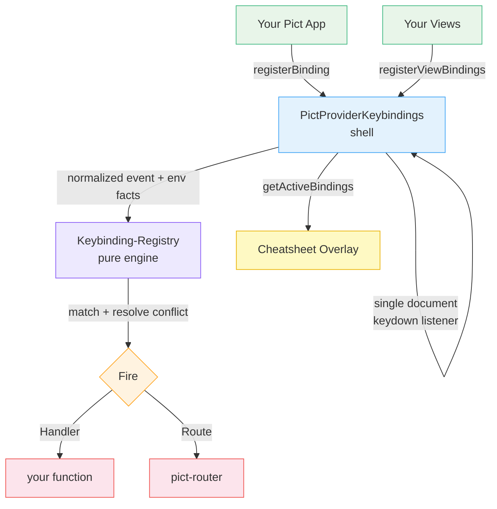

# Pict-Provider-Keybindings

A centralized keyboard-shortcut registry for [Pict](https://fable-retold.github.io/pict/) browser applications. Register a binding once with a name, a description, and a function or a route; views register their own bindings as part of their normal lifecycle; and a built-in cheatsheet overlay — toggled by `?` — shows the user exactly what every active key does.

It is a small, modern dispatcher: one `keydown` listener, `event.key` (never `keyCode`), a `Mod` abstraction that resolves to Cmd on macOS and Ctrl everywhere else, multi-step key sequences, input-field and IME guarding, and a per-binding disable for accessibility. No mousetrap, no global state spread across your views.

## What It Does

Pict-Provider-Keybindings gives a Pict application a single, coherent place for every keyboard shortcut:

- **One registry, many sources** — app-global shortcuts and per-view shortcuts live in the same matcher, with a deterministic conflict-resolution order
- **Functions or routes** — a binding fires a `Handler(event, entry)` or navigates a `Route` through [pict-router](https://fable-retold.github.io/pict-router/) (a soft dependency)
- **Chords and sequences** — `Mod+S`, `Mod+K Mod+S`, `g i` — all supported, with a configurable inter-key timeout
- **A built-in cheatsheet** — press `?` for a themeable overlay that groups the active bindings and renders platform-correct key glyphs (`⌘K` on Mac, `Ctrl+K` elsewhere)
- **Lifecycle-friendly** — a view calls `registerViewBindings(this, [...])` and the provider auto-evicts those bindings once the view's DOM leaves the document — no teardown hook required
- **Safe by default** — guards input/textarea/contenteditable focus, skips IME composition, ignores auto-repeat, and exposes `suspend()` / `resume()` so a modal can pause shortcuts while it owns the keyboard

## Architecture at a Glance



The provider is a thin shell over a single `document` keydown listener. It owns the browser-facing facts — is an input focused? is a view's DOM still alive? is the registry suspended? — and hands a plain, normalized event to a **pure, DOM-free matching engine** (`Keybinding-Registry`). That split keeps essentially all behavior unit-testable with plain `{ key, ctrl, ... }` objects, no jsdom required.

## Key Concepts

### Pure Engine, Thin Shell

`Keybinding-Registry` does all of the parse / normalize / match / eligibility / conflict / sequence-buffering / grouping / platform-formatting work and never touches `document` or `window`. The provider (`PictProviderKeybindings`) owns the single keydown listener, the input/owner-liveness checks, the suspend stack, and the cheatsheet overlay. Firing a `Route` is delegated back to the shell through an injected callback.

### Owners

Every binding belongs to an **owner**. App-global bindings live under a reserved `__app__` owner and persist for the life of the app. Per-view bindings are keyed by the view (its `Hash`), and the provider replaces a view's whole set on each render (so re-renders never duplicate) and prunes the set once the view's destination selector is no longer in the DOM.

### The `Mod` Abstraction

Author shortcuts with `Mod` and the engine resolves it per platform: `Mod+K` matches **⌘K** on macOS and **Ctrl+K** everywhere else. The cheatsheet renders the same way, so users always see the glyphs their own keyboard uses.

### Sequences and Chords

A combo string is space-separated steps; each step is `+`-joined tokens. `Mod+S` is a single chord; `g i` and `Mod+K Mod+S` are two-step sequences resolved against a buffer with a configurable timeout. A stray key or a timeout resets the buffer.

### The Cheatsheet

`?` toggles a themeable overlay built from `getActiveBindings()` — the live, grouped, display-ready set of currently-active shortcuts. Every color is a theme token with a sensible fallback, so it follows the host theme but looks right with no theme provider at all. It can optionally render through [pict-section-modal](https://fable-retold.github.io/pict-section-modal/) instead of its own overlay.

### Guarding, Suspend, and Scopes

Bare keys are suppressed while an input is focused (modifier chords still fire); IME composition and auto-repeat are ignored. `suspend()` returns a token and pushes onto a ref-counted stack so several owners can independently pause shortcuts; `resume(token)` pops. `Scope` makes a binding eligible only while a named scope is active (`pushScope` / `popScope`).

## Quick Example

```javascript
const libKeybindings = require('pict-provider-keybindings');

// 1. Register the provider once on your Pict app
pict.addProvider('Pict-Keybindings', libKeybindings.default_configuration, libKeybindings);

let tmpKeys = pict.providers['Pict-Keybindings'];

// 2. App-global shortcuts — a route or a function
tmpKeys.registerBinding(
	{
		Keys: 'g b', Name: 'Go to board', Description: 'Open the kanban board',
		Group: 'Navigation', Route: '/board'
	});
tmpKeys.registerBinding(
	{
		Keys: 'Mod+k', Name: 'Quick find', Description: 'Open the command palette',
		Group: 'Navigation', Handler: () => myApp.openPalette()
	});

// 3. Per-view shortcuts — in a view's onAfterRender:
//    this.pict.providers['Pict-Keybindings'].registerViewBindings(this,
//        [{ Keys: 'n', Name: 'New card', Handler: () => this.newCard() }]);
```

Press `?` to see the cheatsheet. No deregistration call is required — the per-view binding goes away when the view's DOM does.

## Learn More

- **[Quick Start](Quick_Start.md)** — Add your first shortcut and cheatsheet in five minutes
- **[Architecture](Architecture.md)** — The engine/shell split, the dispatch pipeline, owner lifecycle, and conflict resolution
- **[Implementation Reference](Implementation_Reference.md)** — Every configuration option, binding field, provider method, and the pure-engine API
- **[Function Reference](Function_Reference.md)** — A copy-pasteable code snippet for every public function

## Ecosystem

Pict-Provider-Keybindings is part of the [Retold](https://github.com/stevenvelozo/retold) module suite:

- [pict](https://fable-retold.github.io/pict/) — Core MVC application framework
- [pict-provider](https://fable-retold.github.io/pict-provider/) — Provider base class
- [pict-router](https://fable-retold.github.io/pict-router/) — Hash routing (soft dependency, for `Route` bindings)
- [pict-section-modal](https://fable-retold.github.io/pict-section-modal/) — Optional cheatsheet renderer
- [fable](https://fable-retold.github.io/fable/) — Service infrastructure and dependency injection

## License

MIT

## Example Applications

Live, runnable example applications — each opens in a new browser tab:

- **[Shortcuts Playground](examples/shortcuts_playground/README.md)** — An interactive catalog of every primitive: app-global bindings, chords, sequences, the cheatsheet, suspend/resume, scopes, per-binding disable, and a live active-bindings list. — [Launch live app](examples/shortcuts_playground/index.html)
- **[Kanban Shortcuts](examples/kanban_shortcuts/README.md)** — A multi-view router app showing per-view binding lifecycle (auto-evict on navigation), `Route` shortcuts, and scope-gated keys. — [Launch live app](examples/kanban_shortcuts/index.html)
